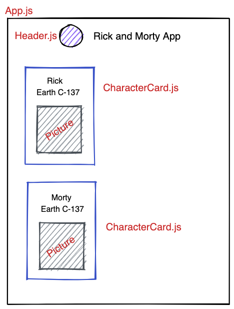

# JS Aufgabe 4 - fetch 
Frage die [Rick and Morty API](https://rickandmortyapi.com/api/character) 
mit `fetch` ab und ersetze deine statischen Daten aus [Aufgabe 3](https://github.com/ankestein/my-first-html)

# Aufgabe Character Card
Füge Character Cards zur Website hinzu:
  

# Aufgabe Character Gallery
Erstelle eine CharacterGallery Komponente, in die die einzelnen CharacterCards gemapped werden.

# Aufgabe Buttons
1. Load-Button: Characters in einen State auslagern und per Button den State setzen
2. Clear-Button: Erstelle einen Button, der bei einem Klick die Characters leert
3. Suchfeld: Erstelle ein Inputfield (`<input>` ). Mit dem die Charaktere nach Namen gefiltert werden können. Die Eingabe “riCK” soll Charakter finden, in deren Namen der String enthalten ist. Unabhängig von Groß-/Kleinschreibung (case-insensitive)
